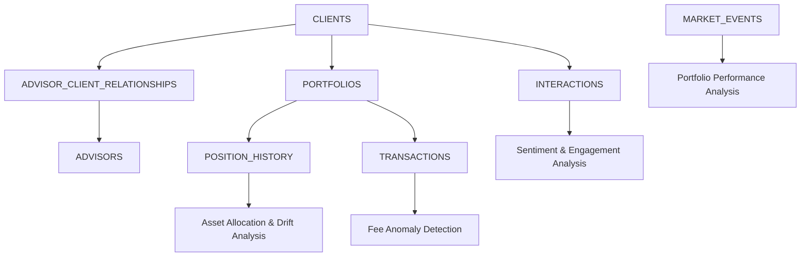

# 🏦 BFSI Wealth 360 - Advanced Analytics Platform

[](https://github.com/Deepjyoti-ricky/wealth-360-streamlit-snowflake/actions/workflows/ci.yml)
[](https://opensource.org/licenses/MIT)
[](https://www.python.org/downloads/)
[](https://www.snowflake.com/)

**Enterprise-grade wealth management analytics platform** built for Banking, Financial Services & Insurance (BFSI) organizations. Leverages **Snowflake's advanced analytics capabilities** with **Streamlit in Snowflake** for native deployment.

> 🚀 **Major Enhancement**: Transformed from basic analytics to comprehensive BFSI platform with **12 advanced use cases**, sophisticated SQL analytics, and AI-powered insights.

## ✨ Platform Highlights

- **🎯 12 Advanced Use Cases** - From customer segmentation to AI-powered briefings
- **🤖 AI-Enhanced Analytics** - GenAI features for client narratives and KYC automation
- **📊 Interactive Visualizations** - Professional dashboards with Plotly integration
- **⚡ Snowpark-First Architecture** - Native Snowflake deployment with seamless local fallback
- **🏢 Enterprise-Ready** - Production-grade code quality, CI/CD, and security standards

## 🎯 Advanced Use Cases Catalog

| Use Case | Business Value | Complexity | TTV | KPIs |
|----------|----------------|------------|-----|------|
| **🎯 Customer 360 & Segmentation** | Single view across balances, portfolios, behavior | Low | 1–2 wks | AUM/NTB growth, segment coverage |
| **🎁 Next Best Action** | AI-driven cross/upsell recommendations | Medium | 2–4 wks | Offer CTR, conversion, AUM lift |
| **⚠️ Churn Early Warning** | Balance flight & engagement drop detection | Medium | 2–4 wks | Churn rate, save rate, time-to-contact |
| **⚖️ Suitability & Risk Drift** | Portfolio compliance monitoring | Medium | 3–5 wks | Suitability breaches, remediation time |
| **📊 Portfolio Drift & Rebalance** | Asset allocation optimization | Medium | 3–5 wks | Drift % over threshold, rebalance yield |
| **💰 Idle Cash / Cash-Sweep** | Monetize idle balances | Low | 1–2 wks | Cash ratio, NII uplift |
| **🔍 Trade & Fee Anomaly Detection** | Statistical outlier detection | Medium | 2–4 wks | Fee recovery, false-positive rate |
| **👥 Advisor Productivity & Coverage** | Relationship management optimization | Low | 1–2 wks | Coverage %, SLA compliance |
| **📅 Event-Driven Outreach** | Life event & market timing triggers | Low | 1–2 wks | Engagement rate, meetings booked |
| **💬 Sentiment Intelligence** | NLP-style complaint analysis | Low | 1–2 wks | NPS proxy, resolution time |
| **🤖 AI Client Briefing** | Auto-generated talking points | Low | 1–2 wks | Prep time saved, call quality |
| **📋 KYC Ops Copilot** | Compliance automation & risk scoring | Medium | 3–6 wks | Cycle time, touchless rate |

## 🏗️ Data Architecture

**Schema:** `FSI_DEMOS.WEALTH_360`



### Core Tables & Usage

| Table | Purpose | Key Analytics |
|-------|---------|---------------|
| **CLIENTS** | Demographics, risk profiles, life events | Customer 360, Segmentation, Risk Assessment |
| **PORTFOLIOS** | Investment strategies, allocation targets | Drift Analysis, Suitability Monitoring |
| **POSITION_HISTORY** | Time-series holdings data | Performance, Concentration, Cash Analysis |
| **TRANSACTIONS** | Trading activity, fees | Anomaly Detection, Revenue Analytics |
| **INTERACTIONS** | Client touchpoints, sentiment | Engagement, Churn Prediction, NPS Analysis |
| **ADVISORS** | Staff metrics, coverage | Productivity, Relationship Management |
| **MARKET_EVENTS** | Economic context periods | Event-Driven Analysis, Performance Attribution |

## 🚀 Deployment Options

### 🏔️ Streamlit in Snowflake (Recommended)

**Zero-configuration deployment** - Upload and run immediately:

1. **Upload Application**
   ```sql
   -- In Snowsight, create new Streamlit app
   -- Upload streamlit_app.py as main file
   ```

2. **Optional Context Configuration**
   ```toml
   # Snowsight Secrets (optional overrides)
   [SNOWFLAKE]
   DATABASE = "FSI_DEMOS"
   SCHEMA = "WEALTH_360"
   WAREHOUSE = "COMPUTE_WH"
   ROLE = "ACCOUNTADMIN"
   ```

3. **Launch** - Application runs immediately with active session

### 💻 Local Development

**Full development environment setup:**

```bash
# 1. Clone Repository
git clone https://github.com/Deepjyoti-ricky/wealth-360-streamlit-snowflake.git
cd wealth-360-streamlit-snowflake

# 2. Environment Setup
python3 -m venv .venv
source .venv/bin/activate  # On Windows: .venv\Scripts\activate

# 3. Install Dependencies (Automated)
python install_dependencies.py

# OR Manual Installation:
# pip install --upgrade pip
# pip install -r requirements.txt

# 4. Configure Secrets (Local Development Only)
cp .streamlit/secrets.example.toml .streamlit/secrets.toml
# Edit with your Snowflake credentials

# 5. Launch Application
streamlit run streamlit_app.py
```

**🚨 Troubleshooting Dependencies:**

If you encounter `ModuleNotFoundError: No module named 'plotly'`:

```bash
# Option 1: Use automated installer
python install_dependencies.py

# Option 2: Manual installation
pip install --upgrade pip
pip install plotly>=5.24.0 streamlit>=1.37.0 pandas>=2.2.0

# Option 3: Force reinstall
pip uninstall -y plotly && pip install plotly>=5.24.0

# Verify installation
python -c "import plotly; print(f'Plotly {plotly.__version__} installed successfully')"
```

## 🛠️ Advanced Technical Features

### 🔧 Architecture Patterns

- **Snowpark-First Design**: Uses `get_active_session()` with intelligent fallback
- **Advanced SQL Analytics**: CTEs, window functions, statistical analysis
- **Caching Strategy**: 10-minute TTL with `@st.cache_data` for optimal performance
- **Error Resilience**: Comprehensive exception handling and user feedback

### 📊 Analytics Capabilities

- **Time-Series Analysis**: ASOF JOINs with MATCH_CONDITION for historical lookups
- **Statistical Modeling**: Anomaly detection using standard deviations and percentiles
- **Risk Scoring**: Multi-factor algorithms for churn prediction and compliance
- **AI Simulation**: Generated talking points and automated document analysis

### 🎨 UI/UX Excellence

- **Professional Design**: Emoji-enhanced navigation with clear visual hierarchy
- **Interactive Visualizations**: Plotly charts with drill-down capabilities
- **Responsive Layout**: Optimized for various screen sizes and user workflows
- **Real-time Feedback**: Dynamic metrics and status indicators

## 🏢 Enterprise Features

### 🔒 Security & Compliance

- **Zero-Secret Deployment**: No credentials needed in Streamlit in Snowflake
- **Secure Local Development**: Git-ignored secrets management
- **Code Security**: Bandit scanning for vulnerability detection
- **Dependency Management**: Pinned versions with security updates

### 🚀 CI/CD Pipeline

```yaml
# Automated Quality Assurance
✅ Code Formatting (Black)
✅ Linting (Flake8)
✅ Type Checking (MyPy)
✅ Security Scanning (Bandit)
✅ Import Sorting (isort)
✅ Pre-commit Hooks
```

### 📈 Performance Optimization

- **Query Efficiency**: Optimized SQL with proper indexing assumptions
- **Data Caching**: Strategic caching to minimize Snowflake compute costs
- **Lazy Loading**: Progressive data loading for large datasets
- **Memory Management**: Efficient DataFrame operations

## 🎯 Business Value Delivered

### 💰 Revenue Impact
- **Cross-sell Optimization**: AI-driven recommendations with priority scoring
- **Fee Recovery**: Anomaly detection catching revenue leakage
- **Cash Monetization**: Idle balance identification with NII calculations

### ⚖️ Risk Mitigation
- **Early Warning Systems**: Churn prediction with balance flight detection
- **Compliance Monitoring**: Automated suitability and concentration alerts
- **Portfolio Optimization**: Drift analysis with rebalancing recommendations

### 🚀 Operational Efficiency
- **Advisor Productivity**: Coverage metrics and relationship management
- **Process Automation**: KYC copilot reducing manual review time
- **Client Experience**: Event-driven outreach and personalized briefings

## 📋 API Reference

### Core Analytics Functions

```python
# Customer Analytics
get_customer_360_segments() -> Dict[str, pd.DataFrame]
    """Wealth segmentation and engagement analysis"""

get_next_best_actions() -> pd.DataFrame
    """AI-driven cross-sell recommendations with revenue impact"""

get_churn_early_warning() -> pd.DataFrame
    """Balance flight and engagement drop detection"""

# Risk & Compliance
get_suitability_mismatches() -> pd.DataFrame
    """Portfolio compliance monitoring"""

get_portfolio_drift_analysis() -> pd.DataFrame
    """Asset allocation optimization with target analysis"""

get_concentration_breaches(threshold_pct: float) -> pd.DataFrame
    """Position concentration risk assessment"""

# Operational Intelligence
get_idle_cash_analysis() -> pd.DataFrame
    """Cash sweep opportunities with NII calculations"""

get_trade_fee_anomalies() -> pd.DataFrame
    """Statistical fee anomaly detection"""

get_event_driven_opportunities() -> pd.DataFrame
    """Life event and market timing analysis"""

# AI-Enhanced Features
generate_wealth_narrative(client_id: str) -> Dict[str, Any]
    """AI-generated client briefing materials"""

get_kyc_insights() -> pd.DataFrame
    """Compliance automation and risk scoring"""

get_sentiment_analysis() -> Dict[str, pd.DataFrame]
    """NLP-style complaint and sentiment analysis"""
```

### Session Management

```python
get_snowflake_session() -> Session
    """Smart session management for Snowflake environments"""

run_query(sql: str) -> pd.DataFrame
    """Cached query execution with error handling"""
```

## 🔧 Development Workflow

### Quality Standards

```bash
# Install development environment
pip install -r requirements-dev.txt
pre-commit install

# Code quality checks
black .                    # Auto-formatting
flake8 .                  # Linting
mypy streamlit_app.py     # Type checking
bandit -r .               # Security scanning
isort .                   # Import organization
```

### Testing Checklist

- [ ] **Streamlit in Snowflake deployment** - Zero-config launch
- [ ] **Local development setup** - Full credential-based testing
- [ ] **All 12 use case tabs** - Functional with sample data
- [ ] **Error scenarios** - Graceful handling of missing data
- [ ] **Performance validation** - Query efficiency with large datasets
- [ ] **Security review** - No credential leaks or vulnerabilities

## 🌟 Demo Scenarios

### Executive Presentation
- **Customer 360**: Wealth tier distribution and engagement insights
- **Revenue Growth**: Next best actions with estimated impact
- **Risk Management**: Early warning systems and compliance monitoring

### Technical Deep-Dive
- **Advanced SQL**: Complex analytics with CTEs and window functions
- **AI Integration**: Sentiment analysis and automated briefings
- **Architecture**: Snowpark patterns and caching strategies

### Business User Training
- **Interactive Dashboards**: Point-and-click analytics exploration
- **Actionable Insights**: Priority-scored recommendations
- **Real-time Monitoring**: Alert systems and performance tracking

## 🤝 Contributing

We welcome contributions to enhance the platform! See [CONTRIBUTING.md](CONTRIBUTING.md) for:

- **Development Guidelines** - Coding standards and patterns
- **Feature Requests** - Enhancement proposals and requirements
- **Bug Reports** - Issue templates and reproduction steps
- **Pull Requests** - Review process and quality gates

## 📄 License

This project is licensed under the MIT License - see the [LICENSE](LICENSE) file for details.

## 🆘 Support & Resources

- 📖 **[Documentation](README.md)** - Complete setup and usage guide
- 🐛 **[Report Issues](https://github.com/Deepjyoti-ricky/wealth-360-streamlit-snowflake/issues)** - Bug reports and technical problems
- 💡 **[Feature Requests](https://github.com/Deepjyoti-ricky/wealth-360-streamlit-snowflake/issues/new?template=feature_request.md)** - Enhancement suggestions
- 🤝 **[Contributing Guidelines](CONTRIBUTING.md)** - Development participation

## 👤 Author

**Deepjyoti Dev**
Senior Data Cloud Architect, Snowflake GXC Team
📧 deepjyoti.dev@snowflake.com
📱 +917205672310

---

**🚀 Built with excellence for the BFSI community using Snowflake's advanced analytics platform**

*Transforming wealth management through intelligent data analytics and AI-powered insights*
